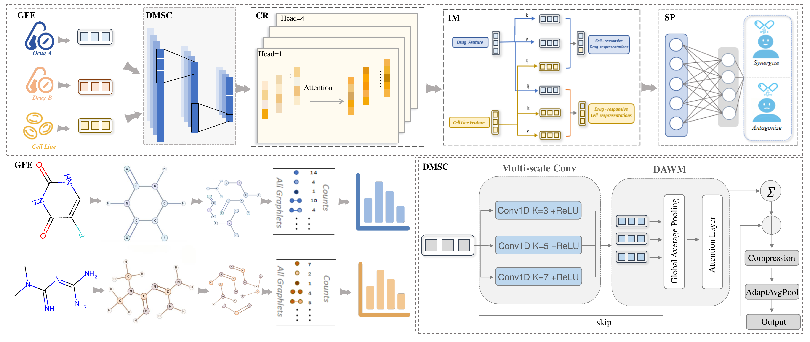

# GraFSyn

**An Interpretable Deep Learning Framework for Anticancer Drug Synergy**

This repository provides the PyTorch implementation of **GraFSyn**, an interpretable deep learning framework for anticancer drug synergy prediction. GraFSyn integrates **drug graphlet features** and **cell-line expression features**, then models drug-cell interactions through **multi-scale convolution**, **attention-based representation learning**, and a final **synergy prediction head**.

## 1. Introduction

Drug combination therapy is an important strategy for improving anticancer efficacy and reducing resistance. However, experimentally screening all possible drug pairs across multiple cell lines is costly and time-consuming. GraFSyn is designed to support this task by learning predictive representations from:

- **Drug A graphlet features**
- **Drug B graphlet features**
- **Cell-line expression features**

At a high level, GraFSyn first encodes drug and cell features, then models cross-interactions between drug-response and cell-response representations, and finally predicts whether a drug pair is **synergistic** or **antagonistic**.

## 2. Framework Overview

<p align="center">
  
</p>

The overall framework is composed of five major stages shown in the figure above:

- **GFE**: constructs graphlet-based structural representations for each drug.
- **DMSC**: uses multi-scale convolution to capture complementary local patterns.
- **DAWM**: adaptively reweights multi-scale responses with attention.
- **CR / IM**: models cross-representation interactions between drug features and cell-line features.
- **SP**: predicts the final synergy label.

## 3. Repository Structure

```text
GraFSyn/
├── data/                       # Input data files
├── lib/                        # Core library: model architecture and dataset classes
│   ├── __init__.py
│   ├── models.py               # GraFSyn model and submodules
│   └── dataset.py              # DrugDataset and CSV loading logic
├── utils/                      # Utility functions
│   ├── __init__.py
│   └── metrics.py              # Evaluation metrics
├── preprocess.py               # Data checking / preprocessing script
├── Train.py                    # K-fold training script
├── requirements.txt            # Python dependencies
└── README.md
```

## 4. Usage

### 4.1 Recommended environment

Please install the required packages with:

```bash
git clone https://github.com/drug-XW/GraFSyn.git
cd GraFSyn
pip install -r requirements.txt
```

### 4.2 Data preparation

By default, the training script expects the following files:

```text
data/Merk/ONEIL_SCORE_Processed.csv
data/Graphlet_features_6.csv
data/Merk/ONEIL_CELL_LINE_EXPRESSION.csv
```

Expected key columns:

- **Main table**: `Drug_A`, `Drug_B`, `Cell_Line`, `Label`
- **Drug graphlet table**: `PubChem_CID` + graphlet feature columns
- **Cell-line feature table**: `Cell_Line` + expression feature columns

### 4.3 Preprocessing

You can validate and clean the input tables before training:

```bash
python preprocess.py \
  --main_csv data/Merk/ONEIL_SCORE_Processed.csv \
  --graphlet_csv data/Graphlet_features_6.csv \
  --cell_csv data/Merk/ONEIL_CELL_LINE_EXPRESSION.csv \
  --output_csv data/Merk/ONEIL_SCORE_Processed_clean.csv
```

This script checks whether each sample in the main table has matching drug and cell-line features, removes invalid samples, and exports a cleaned CSV for downstream training.

### 4.4 Training

Run K-fold cross-validation training with:

```bash
python Train.py \
  --main_csv data/Merk/ONEIL_SCORE_Processed.csv \
  --graphlet_csv data/Graphlet_features_6.csv \
  --cell_csv data/Merk/ONEIL_CELL_LINE_EXPRESSION.csv \
  --output_dir outputs
```

Default training settings include:

- `5`-fold cross-validation
- `100` epochs
- batch size `32`
- learning rate `1e-4`
- model checkpoints and figures saved under `outputs/`

### 4.5 Outputs

After training, the following artifacts are generated:

```text
outputs/
├── checkpoints/               # Best model for each fold
├── figures/                   # Training/validation curves
│   ├── training_loss.png
│   ├── validation_loss.png
│   └── validation_acc.png
└── reports/
    └── cv_results.json        # Fold-wise and summary metrics
```

## 5. Notes

- `Train.py` performs **Stratified K-Fold** training.
- Features are standardized inside each fold before model fitting.
- The final predictor uses a binary classification objective for synergy prediction.

## 6. Citation

If you find this repository useful in your research, please cite your GraFSyn paper. You can replace the placeholder below with the final publication information:

```bibtex
@article{grafsyn,
  title   = {GraFSyn: An Interpretable Deep Learning Framework for Anticancer Drug Synergy},
  author  = {Author names here},
  journal = {Journal / Conference name here},
  year    = {202X}
}
```

## 7. Acknowledgement

We thank the open-source community and the PyTorch ecosystem for providing the tools that support this project. If your implementation builds on prior work, you can also add acknowledgements here for the related methods, datasets, or codebases that inspired GraFSyn.

## 8. License

Please add the license information that matches your intended release policy.
